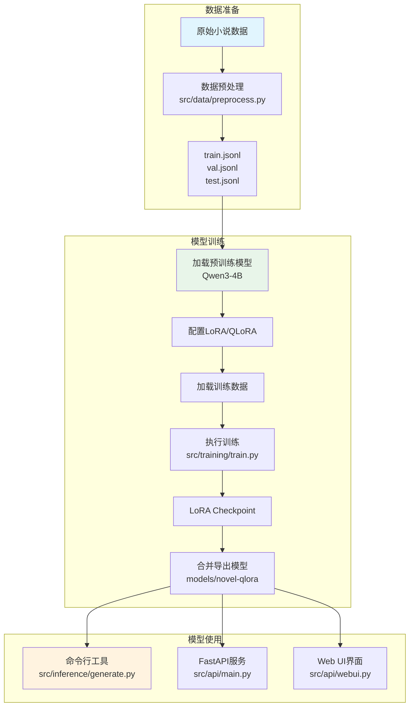

<!-- markdownlint-disable MD033 -->
<div align="center">

# YourNovelHelper

[](https://opensource.org/licenses/MIT)
[](https://www.python.org/)
[](https://github.com/QwenLM/Qwen2.5)

*基于 Qwen3-4B 的小说风格微调项目，帮助用户创建自己喜欢风格的小说*

</div>

---

## 功能特性

| 功能 | 描述 |
|:---:|:---|
| 📚 **数据预处理** | 将原始小说文本转换为训练数据 |
| 🔧 **LoRA 微调** | 使用 QLoRA 低成本微调 Qwen3-4B 模型 |
| 💻 **命令行工具** | 交互式小说续写 |
| 🌐 **Web API** | FastAPI 服务接口 |
| 🎨 **Web UI** | Gradio 图形界面 |

---

## 项目结构

```
YourNovelHelper/
├── config/
│   └── config.yaml          # 配置文件
├── data/
│   ├── raw/                  # 原始数据
│   ├── processed/            # 处理后数据
│   └── output/               # 输出目录
├── src/
│   ├── data/
│   │   └── preprocess.py     # 数据预处理
│   ├── training/
│   │   └── train.py          # 模型训练
│   ├── inference/
│   │   └── generate.py       # 推理生成
│   └── api/
│       ├── main.py           # FastAPI 服务
│       └── webui.py          # Gradio Web UI
├── models/                   # 模型存储
├── logs/                     # 日志
└── scripts/                  # 脚本
```

---

## 项目流程



---

## 快速开始

### 1. 创建虚拟环境并安装依赖

推荐使用 [uv](https://github.com/astral-sh/uv) 管理 Python 环境：

```bash
# 创建虚拟环境
uv venv

# 激活环境 (Linux/Mac)
source .venv/bin/activate

# Windows
# .venv\Scripts\activate

# 安装依赖
uv pip install torch transformers peft datasets trl accelerate pyyaml
uv pip install fastapi uvicorn gradio jieba tqdm scikit-learn
uv pip install modelscope
```

或者安装项目（包含所有依赖）：

```bash
uv pip install -e .
```

> **注意**: 如果没有 uv，请先安装: `pip install uv`

> 激活环境后，后续命令可以直接使用 `python` 运行。

### 2. 准备数据

将小说文本文件放入 `data/raw/` 目录，支持格式:
- `.txt` 文件
- `.json` 文件 (包含 `text` 字段或 `texts` 数组)

### 3. 数据预处理

```bash
python -m src.data.preprocess --raw-dir data/raw --output-dir data/processed
```

### 4. 训练模型

```bash
python -m src.training.train
```

训练参数可在 `config/config.yaml` 中修改。

### 5. 使用模型

> **注意**: 默认使用 ModelScope 加载 Qwen3-4B 模型。如需使用其他模型，可在命令中指定。

#### 命令行

```bash
# 交互模式
python -m src.inference.generate --interactive

# 单次生成
python -m src.inference.generate --prompt "清晨的阳光透过窗户"
```

#### Web API

```bash
python -m src.api.main
```

访问 http://localhost:8000/docs 查看 API 文档。

#### Web UI

```bash
python -m src.api.webui
```

访问 http://localhost:7860 打开 Web 界面。

---

## 统一运行入口

项目提供 `run.sh` 统一入口，支持 CLI 和 Docker 两种运行模式。

### 使用方式

```bash
./run.sh <cli|docker> <command> [options]
```

### 可用命令

| 命令 | 说明 |
|:---|:---|
| `download` | 从 ModelScope 下载模型 |
| `preprocess` | 预处理小说数据集 |
| `train` | 微调模型 |
| `generate` | 文本补全 |

### 示例

```bash
# CLI 模式（宿主机运行）
./run.sh cli download --model Qwen3-4B --output ./models
./run.sh cli preprocess --raw-dir ./data/raw --output-dir ./data/processed
./run.sh cli train --model-dir ./models --data-dir ./data/processed --output-dir ./models/checkpoints --logs-dir ./logs
./run.sh cli generate --model-dir ./models --base-model Qwen3-4B --lora ./models/novel-qlora --prompt "小说开头"

# Docker 模式（容器内运行）
./run.sh docker download --model Qwen3-4B --output ./models
./run.sh docker preprocess --raw-dir ./data/novels --output-dir ./data/processed
./run.sh docker train --model-dir /app/models --data-dir /app/data/processed --output-dir /app/models/checkpoints --logs-dir /app/logs
./run.sh docker generate --model-dir /app/models --base-model Qwen3-4B --prompt "开头"
```

详细参数请运行 `./run.sh` 查看帮助。

---

## Docker 部署

### 1. 下载模型（推荐）

模型目录结构：
```
models/
├── Qwen3-4B/          # 基础模型
├── Qwen3-7B/           # 可选其他模型
└── novel-qlora/        # 训练后的 LoRA
```

下载模型：
```bash
# 下载 Qwen3-4B (默认，约 8GB)
python scripts/download_model.py

# 查看可下载的模型
python scripts/download_model.py --list
```

### 2. 构建镜像

```bash
docker build . --tag your-novel-helper:latest
```

### 3. 运行容器

```bash
# 使用本地模型目录
docker run -d -p 8000:8000 \
  -v $(pwd)/models:/app/models \
  -e MODEL_DIR=/app/models \
  -e BASE_MODEL=Qwen3-4B \
  -e LORA_NAME=novel-qlora \
  your-novel-helper:latest

# 或使用 ModelScope 自动下载
docker run -d -p 8000:8000 your-novel-helper:latest

# 运行 Web UI
docker run -d -p 7860:7860 \
  -v $(pwd)/models:/app/models \
  -e MODEL_DIR=/app/models \
  -e BASE_MODEL=Qwen3-4B \
  your-novel-helper:latest python -m src.api.webui
```

### 4. 使用 Docker Compose

创建 `docker-compose.yml`:

```yaml
version: '3.8'

services:
  api:
    build: .
    ports:
      - "8000:8000"
    volumes:
      - ./models:/app/models    # 挂载模型目录
      - ./data:/app/data        # 挂载数据
    environment:
      - MODEL_DIR=/app/models
      - BASE_MODEL=Qwen3-4B
      - LORA_NAME=novel-qlora
      - PYTHONUNBUFFERED=1
    deploy:
      resources:
        reservations:
          devices:
            - driver: nvidia
              count: 1
              capabilities: [gpu]
```

运行:

```bash
docker-compose up -d
```

### 环境变量说明

| 变量 | 说明 | 默认值 |
|:---|:---|:---|
| `MODEL_DIR` | 模型目录（包含多个模型子目录） | `models` |
| `BASE_MODEL` | 基础模型名称（model_dir 下的子目录名） | `Qwen3-4B` |
| `LORA_NAME` | LoRA 模型名称（model_dir 下的子目录名） | `` |
| `CONFIG_PATH` | 配置文件路径 | `config/config.yaml` |

### CLI 使用方式

```bash
# 使用本地模型
python -m src.inference.generate \
  --model-dir models \
  --base-model Qwen3-4B \
  --lora novel-qlora \
  --prompt "清晨的阳光"

# 交互模式
python -m src.inference.generate \
  --model-dir models \
  --base-model Qwen3-4B \
  --interactive
```

---

## 配置说明

`config/config.yaml` 主要配置项:

| 配置项 | 说明 | 默认值 |
|:---|:---|:---|
| `model.name` | 模型名称 (支持 ModelScope 模型 ID 或本地路径) | Qwen3-4B |
| `training.method` | 训练方法 | qlora |
| `training.lora_rank` | LoRA rank | 16 |
| `training.num_epochs` | 训练轮数 | 3 |
| `inference.temperature` | 生成温度 | 0.7 |
| `api.port` | API 服务端口 | 8000 |

---

## 硬件要求

| 场景 | 最低要求 |
|:---|:---|
| **训练** | 8GB 显存 (QLoRA) |
| **推理** | 6GB 显存 |

---

## 示例

```python
from src.inference.generate import NovelGenerator

# 使用默认模型 (Qwen3-4B from ModelScope)
generator = NovelGenerator()
result = generator.generate(
    prompt="雨夜，城市的一角",
    style_prompt="金庸的武侠风格"
)
print(result)
```

---

## API 示例

```bash
curl -X POST http://localhost:8000/generate \
  -H "Content-Type: application/json" \
  -d '{
    "prompt": "主人公走在街上",
    "style": "悬疑推理",
    "max_new_tokens": 1000
  }'
```

---

## 许可证

MIT License

---

> 本项目由 [OpenCode](https://opencode.ai) AI 编程助手协助开发。
